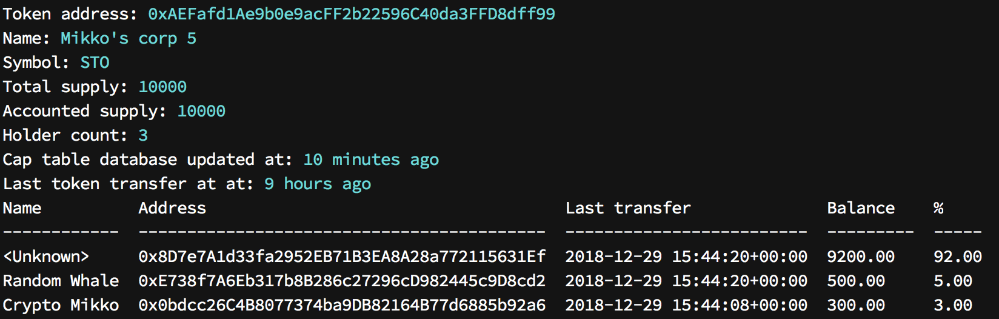

Cap table
=========

Cap table show the current ownership, or token holding addresses, of security tokens.

Cap table can be printed for the current moment or any moment in the past.

Cap table output may contain the real world identities of the owners, if supplied via external CSV file, or just plain Ethereum addresses.

Scanning token holders first
----------------------------

To print out the cap table, first you need to build the local database of token transactions. See :doc:`token scanner <scanner>` for details.

Printing out the token holder cap table
---------------------------------------

Use ``sto cap-table`` command to print out different views on the table.

Here we print out the cap table

* For security token :doc:`we issued earlier <issuance>`

* Distributed to the share holders in the example file :doc:`we used earlier <distribute>`

First we download the file that contain read world identities of token holder addresses:

.. code-block:: shell

    # Download example CSV file provided with source code repository
    curl -O "https://raw.githubusercontent.com/TokenMarketNet/sto/master/docs/source/example-ids.csv"

Then we can use this file and our local token transfer database to print out the current cap table:

.. code-block:: shell

    sto --config=myconfig.ini cap-table \
        --identity-file=example-ids.csv \
        --token-address=0xAEFafd1Ae9b0e9acFF2b22596C40da3FFD8dff99

Cap table looks like this:

Further information
-------------------

See :ref:`cap-table` command for ordering and formatting options.

