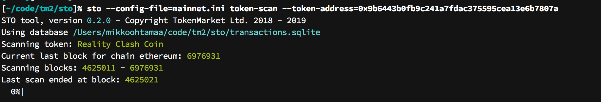

=========
Cap table
=========

.. _captable:

Introduction
============

Cap table show the current ownership, or token holding addresses, of security tokens.

Cap table can be printed for the current moment or any moment in the past.

Cap table output may contain the real world identities of the owners, if supplied via external CSV file, or just plain Ethereum addresses.

Synchronising with blockchain
=============================

To print out the cap table, first you need to build the local database of token transactions.

Token holder balances ae managed in a blockchain. Accessing token holder information real time from a blockchain is non-trivial. For complex operations, like printing out the cap table, we need to crunch the blockchain data first to a local database.

``sto`` can scan the blockchain and construct a database of all past token transactions. Based on this information we can print out the cap table in any point of time.

Scanning token holders
----------------------

To scan all transactions of your security token use ``token-scan`` command. Use the token address for which you have created a distribution.

.. code-block:: console

    sto --config=myconfig.ini token-scan --token-address=0x1091aA1ED6070eDEDFdf46f665C1eD78Bd2c7431

Scan may take few minutes, as the operation walks through the whole blockchian. In the end, it should print:

.. code-block:: text

    Scanning token: Mikko's corp 5
    Current last block for chain kovan: 9880112
    Scanning blocks: 133739 - 9880112
    Last scan ended at block: 133749
    Scanning block: 9524384, batch size: 500000: : 9890620it [00:13, 104737.39it/s]
    Updated 3 token holder balances

Reruns
------

Rerunning `sto token-scan` starts from the block where it was left last time. We look back few blocks (10) to ensure that any transfers lost in minor blockchain forks are corrected.

About the scan algorithm
------------------------

The provided scan algorithm is referential in the nature. It may not scale to large number or tokens or token holders. The algorithm has been designed the limitations of SQLite databases in mind.

Printing to cap table
---------------------

After you have scanned the balances you can :doc:`print the cap table <captable>`.

Further information
-------------------

See :ref:`token-scan` command.

Printing out cap table
======================

Printing out the token holder cap table
---------------------------------------

Use ``sto cap-table`` command to print out different views on the table.

Here we print out the cap table

* For security token :doc:`we issued earlier <issuance>`

* Distributed to the share holders in the example file :doc:`we used earlier <distribute>`

First we download the file that contain read world identities of token holder addresses:

.. code-block:: shell

    # Download example CSV file provided with source code repository
    curl -O "https://raw.githubusercontent.com/TokenMarketNet/sto/master/docs/source/example-ids.csv"

Then we can use this file and our local token transfer database to print out the current cap table:

.. code-block:: shell

    sto --config=myconfig.ini cap-table \
        --identity-file=example-ids.csv \
        --token-address=0xAEFafd1Ae9b0e9acFF2b22596C40da3FFD8dff99

Cap table looks like this:

.. image:: screenshots/captable.png
    :width: 500 px

Further information
-------------------

See :ref:`cap-table` command for ordering and formatting options.

Cap table for any ERC-20 token
==============================

These are quick instructions to print the cap table for any ERC-20 token.

``sto token-scan`` and ``sto cap-table`` command support creating token holder database of any ERC-20 token, not just security tokens or tokens you have issued yourself. If you need to use token holder or transfer data in your application you can read it directly from ``sto`` SQLite database.

.. note::

   As most of the ERC-20 tokens are payment terms, using term cap table is little bit misleading.
   The term "token holders" is more generic.

Preparing and printing out token holders
----------------------------------------

Here is a quick tutorial how to print out the token holders of `Reality Clash <https://realityclash.com>`_ token.

First create a INI configuration while that connects to `Infura Ethereum mainnet node <http://infura.io/>`_ or your local mainnet node.

``mainnet.ini`` example:

.. code-block:: ini

    # Network we are using
    network = ethereum

    # Get this from your Infura dashboard
    ethereum-node-url = https://mainnet.infura.io/v3/453...

Then scan all RCC token transactions of all time. Please note that the scan process may take anywhere between 15 minutes to few hours depening on how fast your connection to the node and computer are.

.. code-block:: shell

    sto --config=mainnet.ini token-scan --token-address=0x9b6443b0fb9c241a7fdac375595cea13e6b7807a

.. note::

    If the scan is interrupted it will pick up where it was left last time. You can also manually interrupt the application with CTRL+C.

Now you can print out the cap table. Here is how to print out top 10 token holders:

.. code-block:: shell

    sto --config=mainnet.init cap-table \
        --token-address=0x9b6443b0fb9c241a7fdac375595cea13e6b7807a \
        --order-by=balance \
        --order-direction=desc \
        --max-entries=10

And it prints out the RCC top holders table:

.. image:: screenshots/rcc-captable.png
    :width: 500 px

