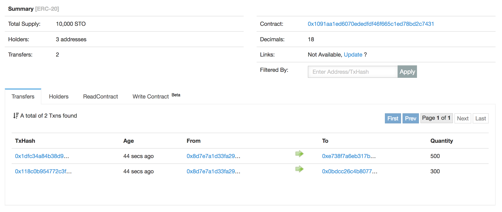

Contract verification on EtherScan
==================================

Verifying contracts on EtherScan
--------------------------------

`EtherScan is a popular service for blockchain exploring <https://etherscan.io>`_. It's verify contract feature allows you to create reproducible builds of your Solidity source code and then EtherScan can introspect your contract state. This is very useful for diagnostics.

For example, you can see browse STO transactions easily:

To verify your contracts on EtherScan, you need to first ensure all contract deployement transactions are broadcasted and mined.

Then add your EtherScan API key in ``myconfig.ini``:

.. code-block:: ini

    # Obtained after signing in to etherscan.io
    etherscan-api-key = T2JC4....

Now you can run verify:

.. code-block:: shell

    sto --config=myconfig.ini tx-verify

Further information
-------------------

See :ref:`tx-verify`.