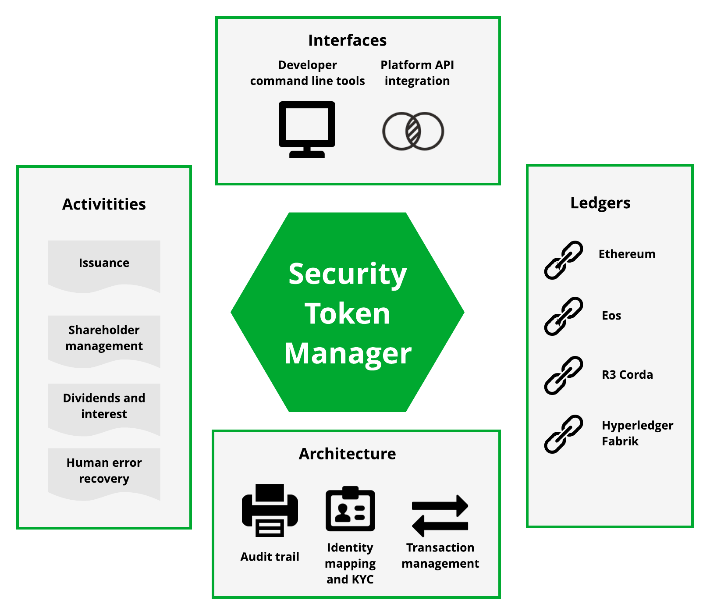

Security Token Manager documentation
====================================

This is the documentation for Security Token Manager. This open source project provides tooling and programming interfaces to interact and integrate security tokens on Ethereum and other blockchains.

Security Token Manager supports operations for security token governance.

* Issue out new stock or bond series as security tokens

* Distributing shares to primary market investors

* Printing out cap table

* Managing bad transactions and lost private keys

* Paying dividends and interest

* Delivering voting ballots

* Maintaining audit logs of delivered actions

The command line tool is locally installed via Docker and available for Windows, OSX and Linux. The API is written in Python programming language.

New to tokens and securities? `Read an introduction for security tokens <https://tokenmarket.net/news/security-tokens/what-are-security-tokens/>`_

.. toctree::
   :maxdepth: 1
   :caption: Contents

   install
   setup
   issuance
   broadcast
   whitelist
   token-summary
   distribute
   captable
   etherscan
   payout
   voting
   smartcontracts
   command-line-reference
   dev

Links
=====

`TokenMarket website <https://tokenmarket.net>`_

`Twitter <http://twitter.com/tokenmarkett>`_

`Documentation <https://docs.tokenmarket.net/>`_

`Github Source code and issue tracker <https://github.com/tokenmarketnet/sto>`_

`Support and chat <https://gitter.im/security-token/Lobby>`_

`Docker releases <https://hub.docker.com/r/miohtama/sto/>`_

`Python releases <https://pypi.org/project/sto/>`_

`Smart contracts repository <http://github.com/tokenmarketnet/ico>`_

`Change history <https://github.com/TokenMarketNet/sto/blob/master/CHANGES.rst>`_

