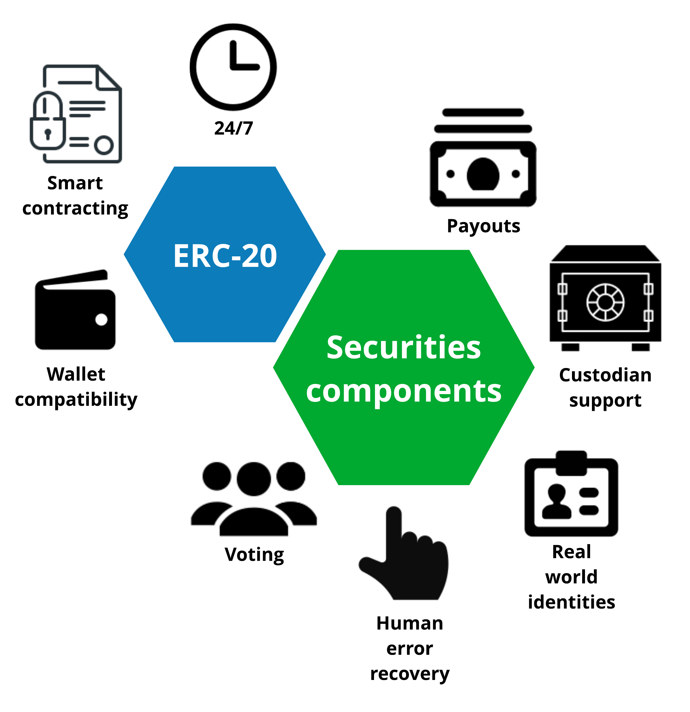
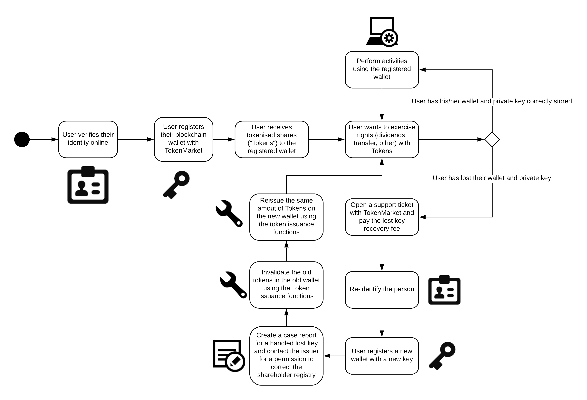

===============
Smart contracts
===============

.. contents:: :local:

Introduction
============

TokenMarket provides its in-house developed security token smart contracts for Ethereum blockchain.

**Key points**

* Ethereum public blockchain

* Can present tokenised equity (shares) and debt (bonds) financial instruments

* ERC-20 based

* Securities componentes added to support corporate governance and shareholder management

* Open source

* Tools available for developers to manage and integrate

`Source code of security token smart contracts can be found on Github <https://github.com/TokenMarketNet/smart-contracts/tree/master/contracts/security-token>`_.

Other security token standard candidates
----------------------------------------

Security Token Manager tool (``sto``) is designed to work with other security tokens as well, as most ERC-20 based security tokens follow very similar structure.

We believe it is still very early for standardisation efforts of security token protocols or blockchains. We also believe that with out vast experience with smart contracts, issuances and securities regulation allows us to make the best design decisions in security token programming.

Other token standards include

* ERC-1400

* ERC-1462

* ERC-1600

* ST-20

Securities vs. cryptocurrencies
===============================

Securities (real world assets) differ from cryptocurrencies (virtual assets)

* Securities have an **issuer** and there exists an implicit trust between the investors and the issuer

* Securities often need to have real world identities associated with the ownership - a shareholder registry

* Securities pay dividends or interest

By their nature, security tokens needs less hardcode decentralisation, as there always exist corresponding assets in the real world. Or opposite, losing of private keys cannot result losing the ownership of your assets.

Issuer control mechanism
========================

.. image:: screenshots/issuer-control.png
    :width: 800 px

TokenMarket security token can run both on public and private blockchains. It is immune to negative effects typically assumed with cryptocurrencies, like hacks and lost private keys. The issuer maintains the master shareholder registry access which ultimately allows to fix human errors shareholders cause for themselves.

The company board nonimates a technical advisor who will execute board decisions like paying dividends or issuing new shares. Other technical advisor activities include managing shareholders registry, recovering shares from lost private keys and fixing human errors in invalid transfers.

TokenMarket security token smart contract has role based mechanism to delegate authority or partial authority to different set of keys. The technical advisor manages these keys. For the security reasons, the technical advisor is using a multisignature wallet where multiple people need to confirm critical activities that affect the shareholder balances.

`More about different roles in the SecurityToken source code <https://github.com/TokenMarketNet/smart-contracts/blob/master/contracts/security-token/SecurityToken.sol>`_.

Restricting share transfers
===========================

TokenMarket security token supports restricting share transfers. This helps to

* Enable collection of real world identities of shareholders

* Ensure all investors receiving shares are qualified to be in the cap table

* Make shares restricted shares and ensure Board can approve any new shareholders

* Ensure there is an online communication method for all investors

There can be multiple parties that maintain real world identity registries and whitelists.

See `AdvancedTransfeAgent <https://github.com/TokenMarketNet/smart-contracts/blob/master/contracts/security-token/AdvancedTransferAgent.sol>`_ for source code.

Fixing human errors
===================

The issuer, with the help of the technical advisor, can fix errors caused by the shareholder mistakes.

Recovering lost shares
----------------------

Unlike decentralised cryptocurrencies, issuer controlled financial instruments allow more relaxed private key management. Because real world identifies are known and the issuer can replace damaged tokenised shares, it is possible to establish a process where a bad key management errors are recovered. This is not totally different for replacing a lost credit cards.

In the case a shareholder reports that they have lost access to their private key, they can go through a recovery process where the lost shares are invalidated and the corresponding amount of new shares are issued to the shareholder.

For more information see `forceTransfer() function in the source code <https://github.com/TokenMarketNet/smart-contracts/blob/master/contracts/security-token/SecurityToken.sol>`_.

Unauthorised trades
-------------------

The shareholder might become a victim of fraud and have their shares stolen. This is not different of mismanaging one's online bank account or credit cards and have an unauthorised transfers there.

* The shareholder does not properly manage their private keys and unauthorised party gains access

* The shareholder organisation is a victim of insider traud

If the unauthorised party manages to liquidate the shares, how cases of rights on stolen title are resolved depend on a jurisdiction. The issuer and its technical advisor can always follow the court decisions if unsure. `For more insights read this Twitter discussion <https://twitter.com/moo9000/status/1102154193010393090>`_.

Custodianship
=============

In custodised assets

* Assets owner multiple entities are pooled into the same wallet

* Sometimes this is for security (cold wallet), sometimes this is necessary for business activity (exchange hot wallets)

* We need to be able clear ultimate beneficial owners for the assets in this custodian wallet

Custodians need to ensure take care that their benefactors receive payouts and voting rights correctly.

There are two typical case of custodianships for security tokens: custodian companies and exchanges.

Custodial companies
-------------------

For institutional investors, it is often required to use a custodian company for the concern of separation of duties.

With TokenMarket security tokens, the custodian can safely hold investors' assets in a pooled cold wallet and then report the the ultimate beneficial ownership structure behind those assets.

Exchange wallets
----------------

Exchange that are based on hot wallets do not offer blockchain transparency for ownership over trades.

Exchanges trading security tokens must report both

* New ownership

* Trades made (as consolidated tape)

`Good information about reporting requirements can be found in European Union MIFID II RTS (Regulatory Technical Standards) <https://fia.org/articles/mifid-ii-rts-published-eu-official-journal>`_.

Real time reporting protocol
----------------------------

TokenMarket provides a HTTPS based protocol for reporting trades and changes in the ownership. Details to followCustodianship.png.

Payouts
=======

Smart contract support on-chain payouts - dividends and interest.

See :doc:`payouts <payout>` for more information.

Voting
======

Smart contract support on-chain and off-chaibn voting for shareholders.

See :doc:`voting <voting>` for more information.

Announcements
=============

Announcements is a mechanism built into the security token to allow the issuer to inform market participants about the events

* Attaching metadata to tokens, like company legal information and International Securities Identification Number (ISIN)

* Inform traders about upcoming declaration dates for dividends

The security tokens can be self describing on a blockchain. In the future, there is less need to maintain a registry of different securities, as you can get the same information direcly from a blockchain in the form of issuer announcements.

`For more about different roles in the SecurityToken source code <https://github.com/TokenMarketNet/smart-contracts/blob/master/contracts/security-token/SecurityToken.sol>`_.
